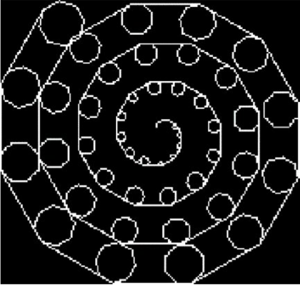
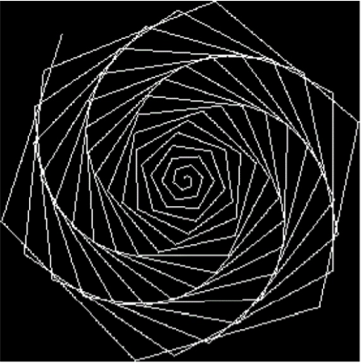

# Exercises-in-C
<b>Some of the assignments I was given as part of my module in ANSI-C</b>

<b>Turtle</b> 
Based on (['Turtle Graphics'](https://en.wikipedia.org/wiki/Turtle_graphics)), I built a parser and interpreter which could take a set of file instructions such as 'Forward 30, Left 45' and build graphical structures such as the examples below: 

  
  

  Spiral shapes from turtle instructions

<b>ADTs: Hashing</b> 
Using a hashing algorithm that searches through text (eg 'Pride and Prejudice ' book) to find specific words. 

<b>Forest Fires</b> 
Creating a terminal stimulation of a 'Forest fire' following a set of logical rules given to us in the assignment based on how the fire behaves, and what creates tree growth (see gif below). The @'s represent trees, and the \*'s represent fire. 

  

  Example of how Forest fires appears on the terminal.

