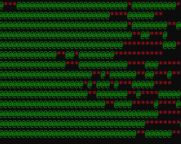

# Exercises-in-C
<b>Some of the assignments I was given as part of my degree in ANSI-C</b>

<b>ADTs</b>

<b>Forest Fires</b>
Creating a 

  

  Example of how Forest fires appears on the terminal.

